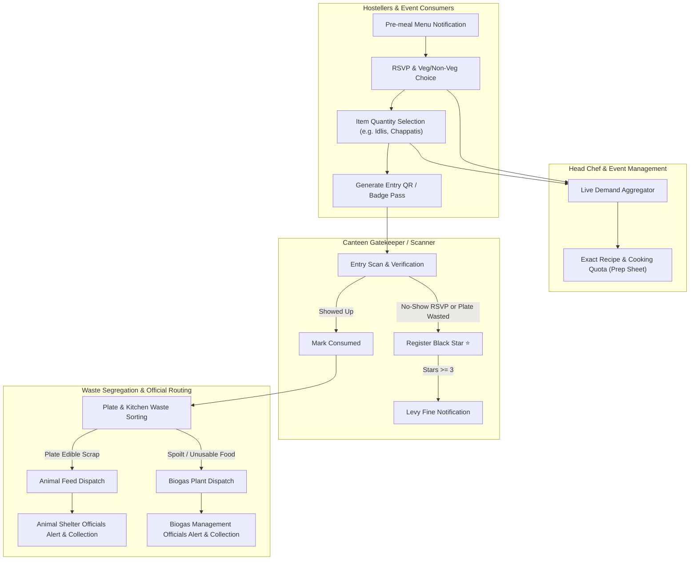

# Implementation Plan: FeedForward - Smart Food Demand, Hostel Black Star Penalty & Waste Redistribution System

A full-stack solution addressing food overproduction and waste management across **Hostels**, **Events/Restaurants**, and **Waste Processing Officials (Animal Feed & Biogas)**.

---

## Architecture Overview

---

## User Review Required

> [!IMPORTANT]
> **Key Business Logic & Policy Confirmation:**
> 1. **Black Star Threshold**: 3 black stars triggers a mandatory fine. Black stars are issued when:
>    - A student RSVPs "Yes" for a meal but fails to check in at the canteen entry counter (No-Show).
>    - A student is flagged for plate food wastage at the disposal counter.
> 2. **Pre-meal Cutoff**: Menus allow selecting exact quantities (e.g. Idlis, Chapattis, Rice bowls) and Veg/Non-Veg preferences up to a scheduled prep cutoff time before meal service starts.
> 3. **Waste Segregation**:
>    - Edible plate leftovers are routed to **Animal Feed**.
>    - Spoilt / contaminated leftovers are routed to **Biogas Management**.
>    - Respective officials receive real-time collection notifications with pickup logs.

---

## Proposed Changes

### Tech Stack
- **Backend**: Node.js with Express, SQLite / in-memory database with persistent file store, WebSocket / SSE for real-time notifications to kitchen and biogas officials.
- **Frontend**: React (Vite) + Tailwind CSS + Lucide Icons + interactive role-switching workspace (Hosteller, Head Chef, Gatekeeper, Biogas Official, Animal Shelter Official, Event Planner).

---

### Backend Components (`/server`)

#### [NEW] `server/package.json`
- Dependencies: `express`, `cors`, `better-sqlite3` (or lightweight JSON database if native compilation is restricted), `uuid`, `dotenv`.

#### [NEW] `server/src/db.js`
- Database schema & seed data:
  - `users`: ID, name, role (`student`, `chef`, `gatekeeper`, `biogas_official`, `animal_shelter`), room/hostel, black_stars, fines_accumulated.
  - `meals`: ID, name, meal_type (`Breakfast`, `Lunch`, `Dinner`), category (`Hostel`, `Event`, `Restaurant`), cutoff_time, menu_items (e.g. Idlis, Chappatis, Rice, Veg/Non-Veg options).
  - `reservations`: ID, user_id, meal_id, will_attend (boolean), dietary_choice (`Veg`, `Non-Veg`), item_quantities (JSON `{ idlis: 3, chappatis: 2 }`), status (`Reserved`, `Entered`, `No-Show`).
  - `black_star_logs`: ID, user_id, meal_id, reason (`No-Show without cancel`, `Excess Plate Wastage`), stars_count, fine_amount, timestamp.
  - `waste_dispatches`: ID, source_name, waste_type (`Animal_Feed`, `Biogas`), quantity_kg, notes, status (`Logged`, `Dispatched`, `Collected`), official_id, timestamp.
  - `notifications`: ID, target_role, user_id, title, message, type, read_status, timestamp.

#### [NEW] `server/src/routes/meals.js`
- Create, view, and schedule upcoming meals.
- Compute prep cutoffs and publish menu notifications.

#### [NEW] `server/src/routes/reservations.js`
- Student RSVP: attendance commitment, veg/non-veg selection, and item quantities.
- Real-time aggregated cooking prep summary for Head Chef.

#### [NEW] `server/src/routes/canteen.js`
- Gatekeeper student entry verification.
- Plate waste penalty trigger: automatically registers Black Stars and applies fine on the 3rd strike.

#### [NEW] `server/src/routes/waste.js`
- Waste logging for plate scrap (Animal Feed) and spoiled food (Biogas).
- Automatic dispatch notification creation for Biogas and Animal Shelter teams.
- Collection lifecycle management (Logged -> Dispatched -> Collected).

#### [NEW] `server/src/routes/notifications.js`
- Fetch and broadcast notifications for students (meal RSVP reminder, black star warning, fine notice) and officials (biogas/animal feed pickup alerts).

---

### Frontend Components (`/client`)

#### [NEW] `client/src/App.jsx` & Navigation
- Role-based multi-partition UI with rapid role switcher:
  1. **Hosteller Portal**: Pre-meal RSVP, Veg/Non-Veg preference, custom item portion sliders, live entry QR code, Black Star meter (1-3 stars with penalty status), notifications.
  2. **Head Chef & Event Planner Kitchen Display**: Live headcount tally, Veg vs Non-Veg breakdown, exact itemized cooking counts (e.g., 450 Idlis, 320 Chappatis), saving estimates.
  3. **Canteen Entry & Waste Logger (Gatekeeper)**: Fast student entry check-in, no-show audit, plate waste logger with instant Black Star issue.
  4. **Biogas & Animal Feed Logistics Hub**: Incoming pickup requests for Biogas and Animal Feed with status updates and environmental impact metrics.

#### [NEW] `client/src/components/HostellerView.jsx`
- Menu notification banner.
- Meal commitment card with portion selector.
- Gamified Black Star meter with 3-star warning and fine alert.

#### [NEW] `client/src/components/ChefDashboard.jsx`
- Real-time demand aggregator display.
- Exact batch preparation calculator based on confirmed RSVPs.

#### [NEW] `client/src/components/CanteenEntryDesk.jsx`
- Quick QR/ID scanner simulator.
- Waste strike penalty assignment tool.

#### [NEW] `client/src/components/WasteLogisticsPortal.jsx`
- Waste routing interface (Edible Plate Scrap -> Animal Feed, Spoilt -> Biogas).
- Official alerts and pickup log tracking.

---

## Verification Plan

### Automated / API Verification
- Test reservation submission: verify quantities (e.g., 3 idlis, 2 chapattis) correctly update chef's aggregate sheet.
- Test no-show & waste strike logic: verify student receives black stars and a fine upon reaching 3 stars.
- Test waste dispatch: verify logging 25kg spoiled food triggers a Biogas notification with correct metadata.

### Manual Verification Flow
1. **As Hosteller**: Select "Attending Lunch: Yes", choice "Non-Veg", portion: "3 Chappatis, 1 Rice bowl". Check that entry QR code is generated.
2. **As Head Chef**: Observe the live dashboard immediately reflects +1 attendee, +1 Non-Veg, +3 Chappatis, +1 Rice.
3. **As Gatekeeper**:
   - Check in a student -> mark entered.
   - For a second student who RSVP'd but didn't show or wasted plate food -> click "Issue Black Star".
   - Verify star increments from 1 -> 2 -> 3 and fine notification pops up.
4. **As Waste Operator**: Log 15kg plate scrap for Animal Feed and 20kg spoiled kitchen waste for Biogas. Verify Biogas official receives notification to collect.
